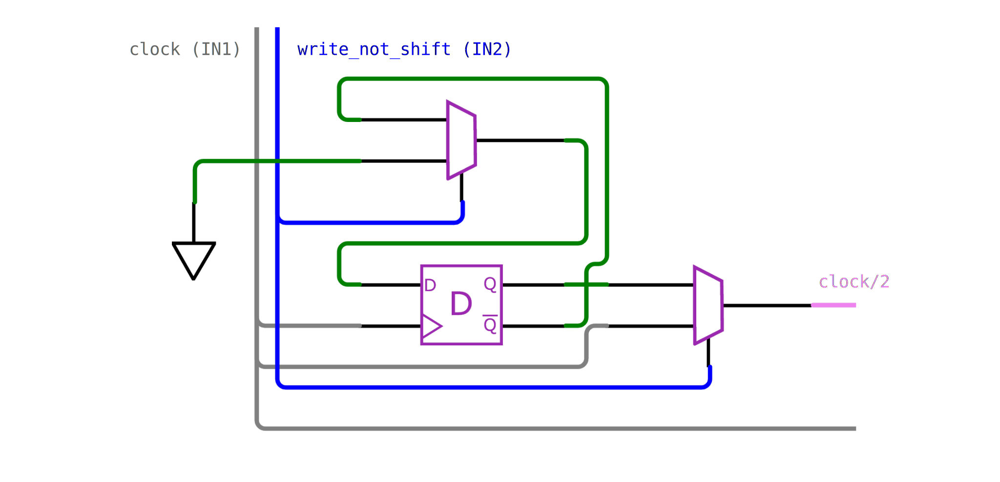
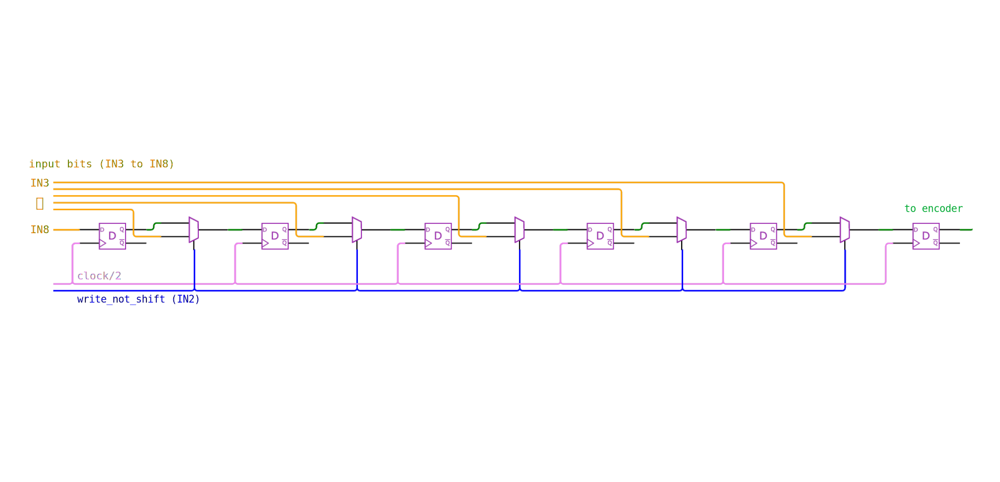
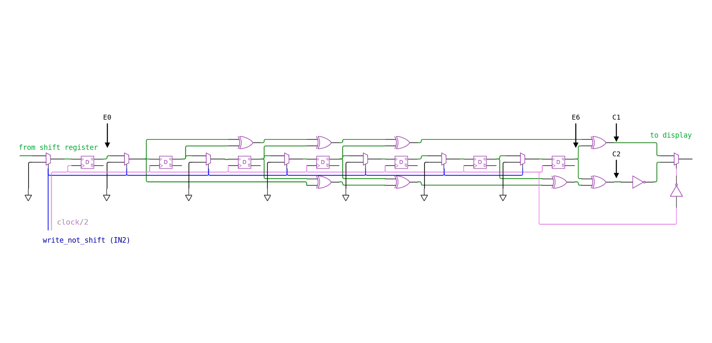

 

# What is Tiny Tapeout?

TinyTapeout is an educational project that aims to make it easier and cheaper than ever to get your digital designs manufactured on a real chip!

Go to https://tinytapeout.com for instructions!

# What is this Tiny Tapeout design?
 
This design implements a (7, 1/2) Convolutional Encoder as used for space communications. A Convolutional Encoder adds additional bits to a data stream or message using a defined pattern (called the Trellis) that may later be used to correct errors in the transmission of the message. The specific implemented encoder is used in space applications and is a half-rate (R = 1/2) code with a constrain lenght of seven (K = 7). This means that the encoder generates two output bits (called symbols) for every input bit, and the encoder has m = K - 1 = 6 states.

Details of the (7, 1/2) Convolutional Encoder are described in the following standards:

* [CCSDS 131.1-G-3 CCSDS RECOMMENDED STANDARD FOR TM SYNCHRONIZATION AND CHANNEL CODING](https://public.ccsds.org/Pubs/131x0b4.pdf) Section 3 Convolutional Coding

* [CCSDS 130.1-G-3 TM SYNCHRONIZATION AND CHANNEL CODING—SUMMARY OF CONCEPT AND RATIONALE](https://public.ccsds.org/Pubs/130x1g3.pdf) Section 4 Convolutional Codes
    * Start with this green book as it provides more background on the concepts

## Documentation

The implemented design consists of a 6-bit shift register and the (7, 1/2) encoder. For each input bit the encoder produces two output bits called symbols, hence the half rate (R = 1/2) designation. The design uses an internal clock divider that shifts the input for each two clock cycles.

The encoder has m = K - 1 = 6 states, each state can be one or zero. The different states are XOR-ed together following two polynominals (G1 = 0b1111001, G2 = 0b1011011), one for each outputs C1 and C2. A one in the polynominal indicates that the state is included in the XOR operation, i.e. for C1 the input, first, second, thrid and sixth states are XOR-ed, for C2 the input, second, third, fifth and sixth states are XOR-ed.

The output of the convolutional encoder serializes the two outputs in the order: C1(0), ~C2(0), C1(1), ~C2(1), etc. The C2 output is inverted to ensure there are sufficient transitions in the output stream i.e. not too many consecutive zeros or ones in a row that might result into loss of symbol lock at the receiver.

### Encoding a message

To write to the shift registers pull the write_not_shift input (IN1) high and set a 6-bit binary input (using IN3 to IN8), for example 0b100110. Provide a clock cycle on the clock input (IN0) to write the input into the shift register and clear the encoder. Pull the write_not_shift input (IN2) low to start shifting. Provide 12 clock cycles (6 input bits x 2 symbol bits = 12), after each clock cycle a 0 or 1 is displayed on the 8-segment display. The encoded output for the input 0b100110 is 0b101110010001 (left-to-right == first-to-last-bit displayed).

As the convolutional encoder is half rate (R = 1/2) it produces twice as many symbol bits as input bits, therefore for a 6-bit input we expect a 12-bit output. However, when you provide more than 12 clock cycles you will notice that the encoder will still generate encoded bits. This is because the first 12 clock cycles will shift the 6-bit message into the convolutional encoder (2 clock cycles per shift), generating 12 output bits, additional clock cycles will shift the message out of the encoder. After providing an additional 12 clock cycles, the output will turn into a constant stream of 01's and zeros.

In other words, when continuing to provide clock cycles, the output will look like: 
0b101110010001 101000111001 010101...(continuing 01's)

This corresponds to an input of:
0b100110 000000 000000...(continuing 0's)

The convolutional encoder can be used for messages larger than 6-bits. After every 2 clock cycles the IN8 input may be changed to shift the next bit into the input shift register as it is not gated by the write_not_shift input (IN2). See also the Section called "Circuits overview - Input Shift Register".

### Decoding the message
TODO

## Circuits overview
The implemented WokWi design consists of a 6-bit shift register and the (7, 1/2) encoder as shown in the figure below. The shift register may be used to quickly input a 6-bit message for encoding. Alternatively the encoder can be used fully serially by clocking data into the last input of the shift register (IN8).

A clean version of the WokWi design (without LEDs) can be found here: [https://wokwi.com/projects/352766597994807297](https://wokwi.com/projects/352766597994807297)

The WokWi circuit consists of 3 major parts, a phase-resettable clock divider, a 6-bit input shift register and the convolutional encoder. The following sections explain each circuit.

### Clock Divider
The clock divider circuit is shown below. The circuit has two inputs: clock (grey, from IN1) and write_not_shift (blue, from IN2), and one output clock/2 (pink). It performs two tasks depending on the state of write_not_shift. If write_not_shift == 0, the circuit turns into a regular clock division circuit using a D-flipflop. If the write_not_shift == 1 two things happen, first the clock signal is directly connected to the clock (meaning no clock division is performed) and second, the input of the D-flipflop forced to zero. This allows the rest of the circuit to operate temporarily (while in writing mode) to operate directly on the clock input without division. Once returned to the shift mode (write_not_shift == 0), clock/2 will start low and go high on the next clock cycle. In other words the phase of the clock divider circuit is set to 0 degrees.

### Input Shift Register
The 6-bit input shift register circuit is shown below. The input shift register consists of 6 D-flipflops and 5 multiplexers. Every two clock cycles (once every clock/2 cycle) the bits are shifted right towards the output. The multiplexers are used to load a new input into the register. This is done by first setting a new input on the IN3 to IN8 bits, then setting write_not_shift == 1 and providing one clock cycle. After setting write_not_shift == 0 the input shift register return to normal shifting operation.

The IN8 input is not gated by a multiplexer, therefore the input of the IN8 pin is always used to fill the last value of the register regardless of the value of write_not_shift. This allows the circuit to be used in serial, providing a new value to IN8 after every two clock cycles.

**Note:** because the IN8 input is not gated, a 6-bit input with the last bit equal to 1 will result into a sequence with trailing 1's to be encoded.

### Convolutional Encoder
The K=7 bit convolutional encoder circuit is shown below. It is similar to the input shift register as 7 D-flipflops (6 for the encoder + 1 to seperate the input shift register and encoder) and 7 multiplexers. The multiplexers are used to clear the encoder when write_not_shift == 1 and a clock cycle is provided.

The encoder generates the symbol bits C1 and C2 by performing "modulo-2 additions" using the two polynomials G1 and G2. These additions are performed by repeated XOR gates, i.e. in bitwise operations C1 = ((( E0 ^ E1 ) ^ E2 ) ^ E3 ) ^ E6) and C2 = ((( E0 ^ E2 ) ^ E3 ) ^ E5 ) ^ E6. The output toggles between C1 and !C2 using a multiplexer.

