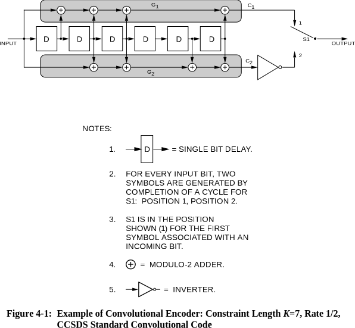
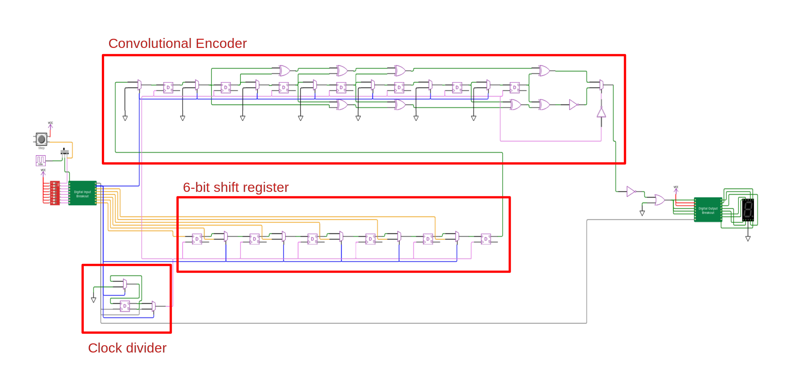

 

# What is Tiny Tapeout?

TinyTapeout is an educational project that aims to make it easier and cheaper than ever to get your digital designs manufactured on a real chip!

Go to https://tinytapeout.com for instructions!

# What is this Tiny Tapeout design?
 
This design implements a (7, 1/2) Convolutional Encoder as used for space communications. A Convolutional Encoder adds additional bits to a data stream or message that may later be used to correct errors in the transmission of the message. The specific implemented encoder is used in space applications and is a half-rate (R = 1/2) code with a constrain lenght of seven (K = 7). This means that the encoder generates two output bits (called symbols) for every input bit, and the encoder has m = K - 1 = 6 states.

Details of the (7, 1/2) Convolutional Encoder are described in the following standards:

* [CCSDS 131.1-G-3 CCSDS RECOMMENDED STANDARD FOR TM SYNCHRONIZATION AND CHANNEL CODING](https://public.ccsds.org/Pubs/131x0b4.pdf) Section 3 Convolutional Coding

* [CCSDS 130.1-G-3 TM SYNCHRONIZATION AND CHANNEL CODING—SUMMARY OF CONCEPT AND RATIONALE](https://public.ccsds.org/Pubs/130x1g3.pdf) Section 4 Convolutional Codes
    * Start with this green book as it provides more background on the concepts

## Documentation

The implemented design consists of a 6-bit shift register and the (7, 1/2) encoder. For each input bit the encoder produces two output bits called symbols, hence the half rate (R = 1/2) designation. The design uses an internal clock divider that shifts the input for each two clock cycles.

The encoder has m = K - 1 = 6 states, each state can be one or zero. The different states are XOR-ed together following two polynominals (G1 = 0b1111001, G2 = 0b1011011), one for each outputs C1 and C2. A one in the polynominal indicates that the state is included in the XOR operation, i.e. for C1 the input, first, second, thrid and sixth states are XOR-ed, for C2 the input, second, third, fifth and sixth states are XOR-ed.

The output of the convolutional encoder serializes the two outputs in the order: C1(0), ~C2(0), C1(1), ~C2(1), etc. The C2 output is inverted to ensure there are sufficient transitions in the output stream i.e. not too many consecutive zeros or ones in a row that might result into loss of symbol lock at the receiver.

### Encoding a message

To write to the shift registers pull the write_not_shift input (IN1) high and set a 6-bit binary input (using IN2 to IN7), for example 0b100110. Provide a clock cycle on the clock input (IN0) to write the input into the shift register and clear the encoder. Pull the write_not_shift input (IN2) low to start shifting. Provide 24 clock cycles (2 each for the 6 shift registers and 6 encoder registers 2x(6+6) = 24). After each clock cycle a 0 or 1 is displayed on the 8-segment display. The encoded output for the input 0b100110 is 0b101110010001101000111001 (left-to-right == first-to-last-bit displayed).

### Decoding the message
TODO

## Circuits overview
The implemented WokWi design consists of a 6-bit shift register and the (7, 1/2) encoder as shown in the figure below. The shift register may be used to quickly input a 6-bit message for encoding. Alternatively the encoder can be used fully serially by clocking data into the last input of the shift register (IN7).

A clean version of the WokWi design (without LEDs) can be found here: [https://wokwi.com/projects/352766597994807297](https://wokwi.com/projects/352766597994807297)

### Clock Divider

### Input Shift Register

### Convolutional Encoder

